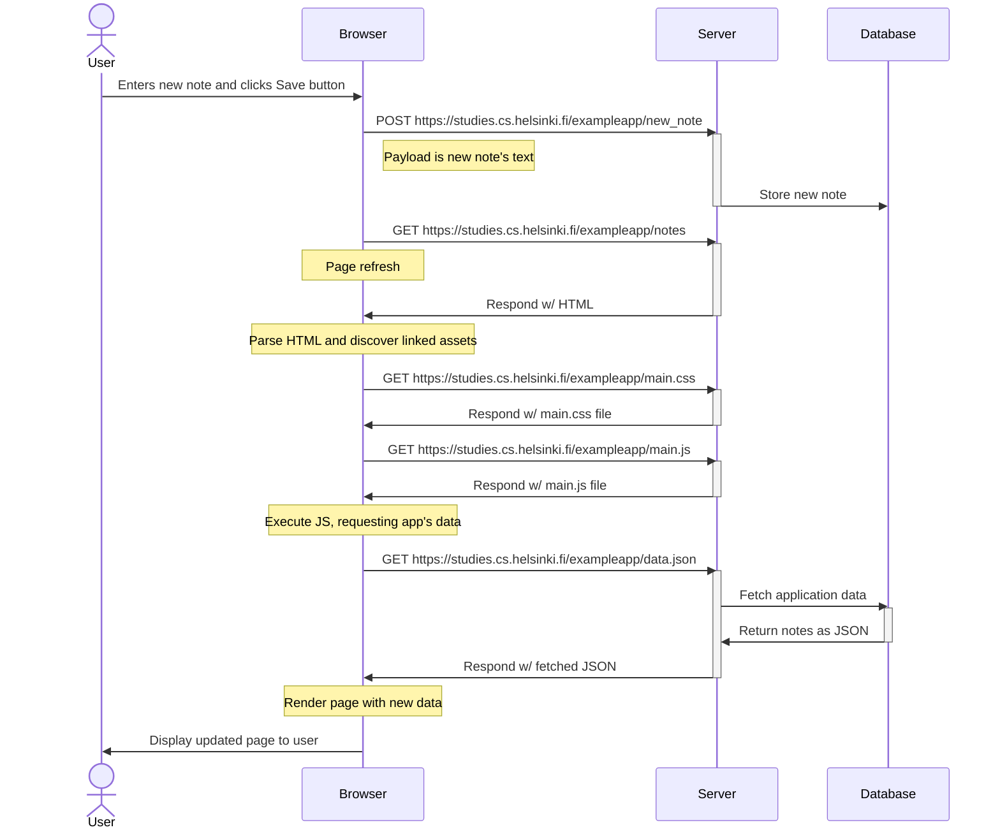

```mermaid
sequenceDiagram
  actor User
  participant Browser
  participant Server
  participant Database

  User->>Browser: Enters new note and clicks Save button

  Browser->>Server: POST https://studies.cs.helsinki.fi/exampleapp/new_note

  activate Server
  Note right of Browser: Payload is new note's text
  Server->>Database: Store new note
  deactivate Server

  Browser->>Server: GET https://studies.cs.helsinki.fi/exampleapp/notes
  activate Server
  Note over Browser: Page refresh
  Server->>Browser: Respond w/ HTML
  deactivate Server

  Note over Browser: Parse HTML and discover linked assets
  Browser->>Server: GET https://studies.cs.helsinki.fi/exampleapp/main.css
  activate Server
  Server->>Browser: Respond w/ main.css file
  deactivate Server

  Browser->>Server: GET https://studies.cs.helsinki.fi/exampleapp/main.js
  activate Server
  Server->>Browser: Respond w/ main.js file
  deactivate Server

  Note over Browser: Execute JS, requesting app's data
  Browser->>Server: GET https://studies.cs.helsinki.fi/exampleapp/data.json
  activate Server
  Server->>Database: Fetch application data
  activate Database
  Database->>Server: Return notes as JSON
  deactivate Database
  Server->>Browser: Respond w/ fetched JSON
  deactivate Server

  Note over Browser: Render page with new data
  Browser->>User: Display updated page to user
```