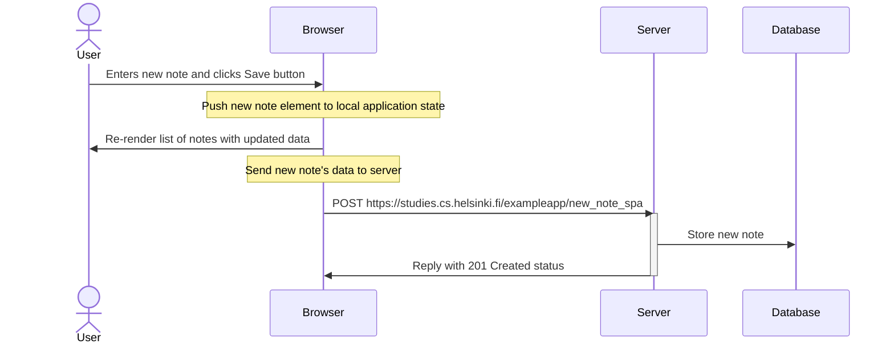

```mermaid
sequenceDiagram
  actor User
  participant Browser
  participant Server
  participant Database

  User->>Browser: Enters new note and clicks Save button

  Note over Browser: Push new note element to local application state
  Browser->>User: Re-render list of notes with updated data

  Note over Browser: Send new note's data to server
  Browser->>Server: POST https://studies.cs.helsinki.fi/exampleapp/new_note_spa

  activate Server
  Server->>Database: Store new note
  Server->>Browser: Reply with 201 Created status
  deactivate Server

```